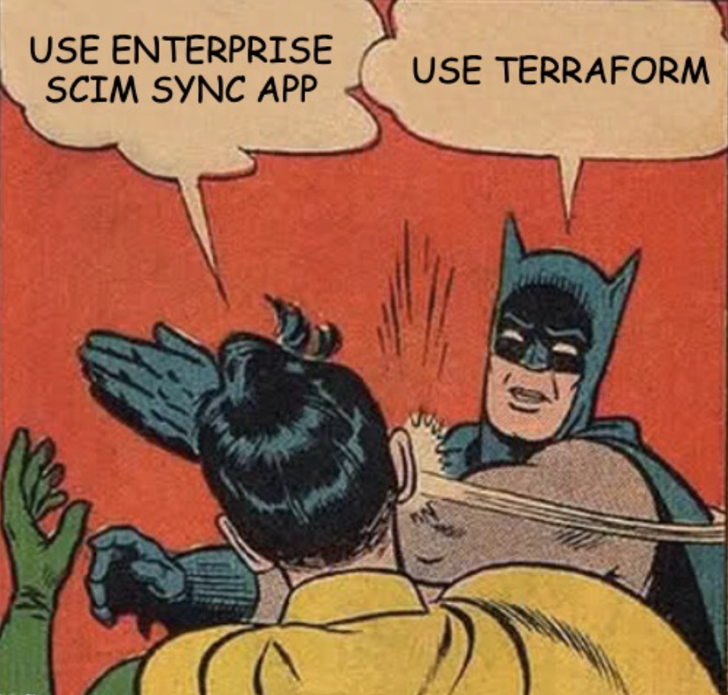

# Azure AAD to Databricks Account SCIM Sync

An example of an end to end synchronization of the whitelisted Azure Active Directory groups and their members into the Databricks Account.

This terraform&python based application supports synchronisation of **Users**, **Groups** and **SPNs** that are members of the whitelisted AAD groups and groups themselves as well.

Yes, that means that group in a group, a.k.a. **nested groups are supported**!

Additionally, the application can be configured to coexist with already configured Azure SCIM Sync Enterprise APP. This way you can leverage already synchronized users and just add support for missing nested groups and spns!



## How to run syncing

- Edit `cfg/groups_to_sync.json`, set list of groups to sync.

  - It is totally expected from application perspective that the list of groups will change over time, hence feel free to build this file dynamically based on your desired setup.

  - Next run of terraform will pickup all needed changes without need of any manual intervention (of course when `--auto-approve` is set in `terraform apply ...`).

- Edit `cfg/account_admin_groups.json`, set list of aad groups whose members should be added as account admins

  - **This is very important step**, as of now the terraform resets admins defined in account console if they are not defined in this file. 

  - **Any changes to `cfg/account_admin_groups.json` once terraform creates `tfplan` will lead to undesired effects, please dont do that. If you need to change the setup in any way, please delete the terraform state to start from scratch**

- Edit `providers.tf`
  - update connection details for databricks account console
  - update connection details for terraform blob storage backend
  - update EA companion mode flag:
    - when `ea_companion_mode = true`: terraform **WILL NOT** sync users, it is expected at this point that users will be synchronized by EA.
    - when `ea_companion_mode = false`: terraform **WILL** sync users.

  - It is still valid configuration to have EA synchronizing users togetter with terraform, but it's not best practice
    - It will put higher load on AAD and Databricks Account API.
    - You may face rare API exceptions where both tools try to modify the same user.
    - It takes more time, as double sync is needed.
    - You have been warned.
  
  - Groups, and SPNs are always maintained independently of value of `ea_companion_mode` flag.

  - **Any changes to `providers.tf` once terraform creates `tfplan` will lead to undesired effects, please dont do that. If you need to change the setup in any way, please delete the terraform state to start from scratch**

- Run `sh sync.sh`, it will do all the syncing for you.
  - By default `sync.sh`  **DOES NOT HAVE `--auto-approve`**. It will require to approve changes manually. 
  Feel free to add `--auto-approve` once you are sure your setup works!

### EA Companion mode

The application allows running in "EA companion mode", where users will be maintained by EA, but groups (and nested groups of course) and spns are mantained by terraform.

To enable "EA companion mode" mode set `ea_companion_mode` to `true` in `providers.tf`

**WARNING**: `ea_companion_mode` **flag MUST be set once and not changed when terraform has ran for first time (has a state file)**

*Details on this:
if `ea_companion_mode` changes from `false` (terraform maintains users) to `true` (terraform does not maintain users anymore). it will be seen as request to delete users from the account console. EA app of course at this point would add users back again, but for period between runs there would be no users in account console.*

### EA <-> Terraform groups synchronization

The whitelisted groups to sync, can be exchanged between EA and terraform, so that there is only one master list of groups that needs synchronisation.

Either EA, or this application can be the reference point. See next two sections for details on how to configure both scenarios.

#### EA is the group reference point

Terraform will use groups that EA syncs. Hence changes to the groups that need to be synced have to be only performed in EA.

In order to do so, create `sync_ea_pull.sh` script:

```bash
#!/bin/sh
python3 sync_aad_groups_to_ea.py \
   --app_name "Azure_Databricks_SCIM_Provisioning_Connector" \
   --tenant_id "83d7850c-d919-43de-a8dd-dd30c5353e52" \
   --spn_id "bab70a68-a7aa-43bc-909f-cd3fc8f38026" \
   --spn_key "[redacted]" \
   --json_dump_ea_principals cfg/groups_to_sync.json
```

and execute `sync_ea_pull.sh` **BEFORE** the `sync.sh`. This will ensure that `cfg/groups_to_sync.json` will be populated with list of groups that are already setup in EA!

The SPN id and key used, should be the ones that is used by EA, or is EA's owner.

#### Terraform is the group reference point

EA will use the groups that terraform uses for synchronization, hence there will be no longer need to log into EA's Azure's Portal Page to make changes to the groups that should be synced.

To push the groups to EA, create `sync_ea_push.sh` script:

```bash
#!/bin/sh
python3 sync_aad_groups_to_ea.py \
   --app_name "Azure_Databricks_SCIM_Provisioning_Connector" \
   --tenant_id "83d7850c-d919-43de-a8dd-dd30c5353e52" \
   --spn_id "bab70a68-a7aa-43bc-909f-cd3fc8f38026" \
   --spn_key "[redacted]" \
   --json_file_name .aad_state.json
```

and execute `sync_ea_push.sh` **AFTER** the `sync.sh` has finished running. This will ensure that groups used by terraform are synced back to EA.

Note that `.aad_state.json` is not a typo. This file gets created by `sync.sh`, and contains AAD `object_id` of all the AAD groups that are defined in `cfg/groups_to_sync.json`.

For testing you can add `--dry-run` parameter to simulate group changes, or `--only-add` parameter to ensure that groups will be added, never removed from EA, or both.

## Technical details on terraform

In order to make testing, and technical TF application implementation simpler I needed to split the terraform code into two terraform applications.

First terraform application, placed in `aad/` folder, does only download aad groups, members, spns, users… and builds all the parameters for the 2nd terraform application. This application does a bit of conditional filtering of members of each of the groups, to make sure that only nested groups which were white listed are included. Results of this data massaging task are written to `.aad_state.json`. 

Second terraform application just goes and applies the known set of resources, without doing any AAD checks. Having the intermediate state written to the json file act both as a good debugger, because I know exactly which groups are synced, but it also eliminated problems with terraform plan, that could break if groups list changes.

This application needs state to handle deletions. State is kept in blob storage defined in `providers.tf`

To run all of this just run `sh sync.sh` :)

## Technical details on ea sync script

See `python3 sync_aad_groups_to_ea.py --help` for list of all options:

```shell
usage: sync_aad_groups_to_ea.py [-h] --app_name APP_NAME --tenant_id TENANT_ID --spn_id SPN_ID --spn_key SPN_KEY [--json_file_name JSON_FILE_NAME] [--verbose] [--dry_run]
                                [--only_add] [--json_dump_ea_principals JSON_DUMP_EA_PRINCIPALS]

options:
  -h, --help            show this help message and exit
  --app_name APP_NAME   Enterprise Application Name
  --tenant_id TENANT_ID
                        Azure Tenant Id
  --spn_id SPN_ID       Deployment SPN Id
  --spn_key SPN_KEY     Deployment SPN Secret Key
  --json_file_name JSON_FILE_NAME
                        JSON file containing all groups
  --verbose             Verbose logs
  --dry_run             Prints action, but does not do any changes
  --only_add            Only adds groups to EA, never removes
  --json_dump_ea_principals JSON_DUMP_EA_PRINCIPALS
                        Dumps EA principals to JSON file
```

## Known limitations / bugs

- acount admins who are not defined in `cfg/account_admin_groups.json` will be removed from the account console on first run when `ea_companion_mode = false` (terraform is responsbile for syncing users)
  [databricks provider github issue tracker](https://github.com/databricks/terraform-provider-databricks/issues/2648)
- users, groups, or spns added via account console are not deleted by this application
- members of groups added via account console are not deleted by this application
  [databricks provider github feature tracker](https://github.com/databricks/terraform-provider-databricks/issues/2645)
- users having emails containing quote character will not be synced
  [databricks provider github issue tracker](https://github.com/databricks/terraform-provider-databricks/issues/2646)

## Credits

- Code in this repo is based on work of Alex Ott @ Databricks (https://github.com/alexott/terraform-playground/tree/main/aad-dbx-sync).
- Code for EA sync (`sync_aad_groups_to_ea.py`) is based on work of Shasidhar Eranti @ Databricks

## Contributing & logging issues

If you think you have found an issue, please log issue in github tracker. Please include steps to reproduce, starting from empty state file, back to your current problem.

If you have an idea on how to improve the application, please also log an issue and describe the feature you are thinking of, also please define impact this feature would have on your work. It will greatly help me to prioritize issues!